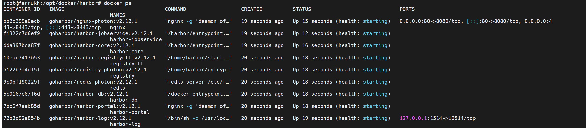
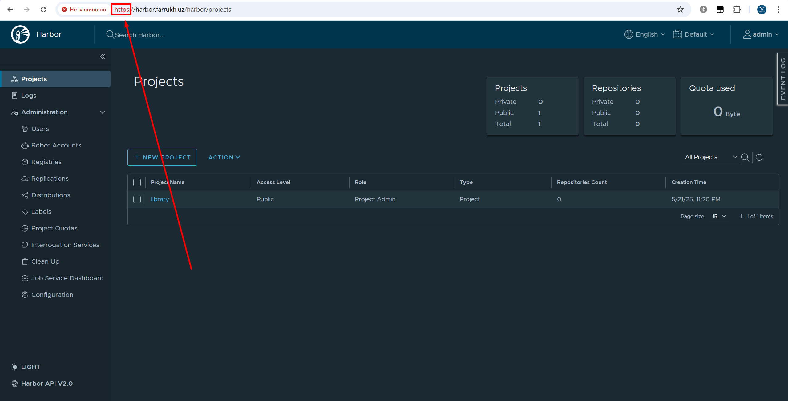

Установим Harbor

Для этого заходим на официальный сайт: ```https://github.com/goharbor/harbor/releases/tag/v2.12.1```

1) Cкачиваем на сервер:  ```wget https://github.com/goharbor/harbor/releases/download/v2.12.1/harbor-online-installer-v2.12.1.tgz```
2) Разархивируем архив: ```tar xzvf harbor-online-installer-v2.12.1.tgz```
3) Создадим папку для работы: ```mkdir /opt/docker```
4) Перенесем папку harbor в opt директорию: ```mv harbor /opt/docker/ && cd /opt/docker/harbor```
5) Создадим необходимые сертификаты:
   ```
   openssl genrsa -out ca.key 4096
   openssl req -x509 -new -nodes -sha512 -days 3650 -subj "/C=UZ/ST=Tashkent/L=Tashkent/O=Farrukh/OU=IT/CN=farrukh.uz" -key ca.key -out ca.crt
   openssl genrsa -out harbor.farrukh.uz.key 4096
   openssl req -sha512 -new -subj "/C=UZ/ST=Tashkent/L=Tashkent/O=Farrukh/OU=IT/CN=harbor.farrukh.uz" -key harbor.farrukh.uz.key -out harbor.farrukh.uz.csr
   ```
6) Создаём файла расширений v3.ext:
   ```
   cat > v3.ext <<-EOF
   authorityKeyIdentifier=keyid,issuer
   basicConstraints=CA:FALSE
   keyUsage = digitalSignature, nonRepudiation, keyEncipherment, dataEncipherment
   extendedKeyUsage = serverAuth
   subjectAltName = @alt_names

   [alt_names]
   DNS.1=harbor.farrukh.uz
   EOF
   ```
7) Подпись CSR и выпуск серверного сертификата:
   ```
   openssl x509 -req -sha512 -days 3650 -extfile v3.ext -CA ca.crt -CAkey ca.key -CAcreateserial -in harbor.farrukh.uz.csr -out harbor.farrukh.uz.crt
   ```

8) Конвертация PEM → CRT (для некоторых систем)  
   ```
   openssl x509 -inform PEM -in harbor.farrukh.uz.crt -out harbor.farrukh.uz.cert
   ```
9) Положим сертификаты в нужные директории:
    ```
    mkdir -p /etc/docker/certs.d/harbor.farrukh.uz
    cp ca.crt /etc/docker/certs.d/harbor.farrukh.uz/
    cp harbor.farrukh.uz.cert /etc/docker/certs.d/harbor.farrukh.uz/
    cp harbor.farrukh.uz.key /etc/docker/certs.d/harbor.farrukh.uz/
    ls /etc/docker/certs.d/harbor.farrukh.uz/
    ```
10) Cоздадим файл harbor.yml: ```mv harbor.yml.tmpl harbor.yml```
11) Редактируем файл harbor.yml: ```nano harbor.yml```
   ```
     # Configuration file of Harbor
     # The IP address or hostname to access admin UI and registry service.
     # DO NOT use localhost or 127.0.0.1, because Harbor needs to be accessed by external clients.
   hostname: harbor.farrukh.uz

     # http related config
   http:
     # port for http, default is 80. If https enabled, this port will redirect to https port
     port: 80

     # https related config
   https:
     # https port for harbor, default is 443
     port: 443
     # The path of cert and key files for nginx
   certificate: /etc/docker/certs.d/harbor.farrukh.uz/harbor.farrukh.uz.cert
   private_key: /etc/docker/certs.d/harbor.farrukh.uz/harbor.farrukh.uz.key
   ```
12) Создадим сервис для harbor: ```nano /etc/systemd/system/harbor.service```
   ```
   [Unit]
   Description=Harbor Container Registry
   Requires=docker.service
   After=docker.service

   [Service]
   Type=oneshot
   RemainAfterExit=true
   WorkingDirectory=/opt/docker/harbor
   ExecStart=/opt/docker/harbor/start.sh
   ExecStop=/opt/docker/harbor/stop.sh
   ExecReload=/opt/docker/harbor/restart.sh
   TimeoutStartSec=0

   [Install]
   WantedBy=multi-user.target
   ```
13) Cтартуем сервис harbor: ```systemctl start harbor.service```
14) Проверим статус: ```systemctl status harbor.service```
15) Добавим сервис в автозагрузку: ```systemctl enable harbor.service```
16) Так же проверим статус контейнеров harbor: ```docker ps```
    
    

17) Как сделать так чтобы сделать сертификат доверенным?

    


