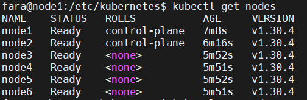
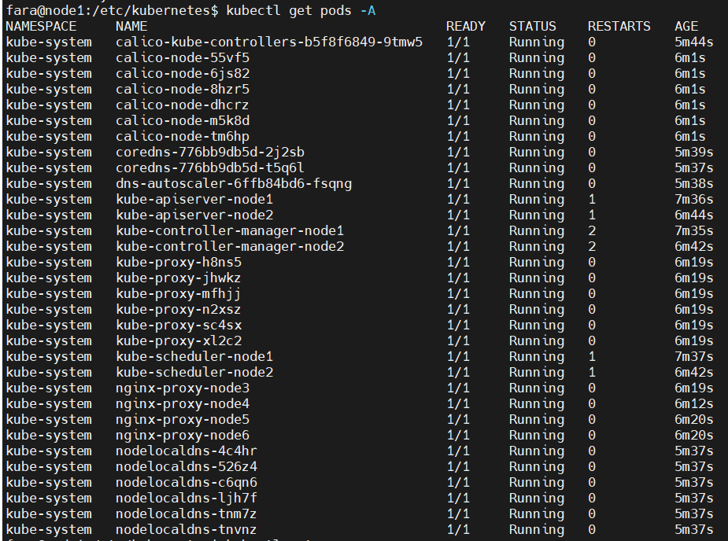

1) Первый очередь поднимем все виртуальные машины
   ```
   Master-Node-1	  192.168.95.15   CPU-2 RAM-4GB   Ubuntu-22.04
   Worker-Node-2	  192.168.95.16   CPU-2 RAM-4GB   Ubuntu-22.04

   ```

2) Для создания кластера Kubespray создадим еще одну виртуальную машину чтобы управлять через Ansible
   ```
   Ansible-Node     192.168.95.21   CPU-2 RAM-4GB   Ubuntu-22.04
   ```
3) Создадим на всех виртуальных машинах нового юзера
   ```
   adduser farrukh
   ```
4) Добавим созданного юзера в sudo группу а так же в безпарольную группу  
    ```
   nano /etc/sudoers

   farrukh ALL=(ALL) NOPASSWD:ALL
   ```
5) Сгенирируем ssh ключ у пользователя root на Ansible-Node
   ```
   sudo su - l
   ssh-keygen -t rsa
   ```
6) Копируем созданный ключ хостам c Ansible-Node от юзера root
   ```
   ssh-copy-id -i /root/.ssh/id_rsa.pub farrukh@192.168.95.15
   ssh-copy-id -i /root/.ssh/id_rsa.pub farrukh@192.168.95.16
   ```
7) Далее узнаем версию Python и создаем виртуальную окружению
    ```
python3 -V
python3 -m venv kubespray-venv   
source kubespray-venv/bin/activate 
   ```
8) Клонируем Kubespray репозиторию
   ```
   git clone https://github.com/kubernetes-sigs/kubespray.git
   cd kubespray
   pip install -r requirements.txt
   ```
9) Скопируем директорию sample чтобы создать свой интвентарь
   ```
    cp -R inventory/sample inventory/mycluster
    ```
10) Отредактируем файл inventory.ini и укажем хосты внутри папки mycluster
11) Так же отредактируем нужные файлы в директории ``` /kubespray/inventory/mycluster/group_vars/k8s_cluster/ ```
12) Запускаем плейбук
    ```
    ansible-playbook -i inventory/mycluster/inventory.ini -u farrukh -b cluster.yml
    ```
13) Видим резултать
    


14) Переходим в Master-Node-1
    ```
    ssh fara@192.168.95.15
    sudo chmod 775 /etc/kubernetes/admin.conf
    export KUBECONFIG=/etc/kubernetes/admin.conf
    kubectl get nodes
    kubectl get pods -A
    ```
15) Видим список Node и Pod

  


  


Официальный Github Kubespray
```
https://github.com/kubernetes-sigs/kubespray
```
