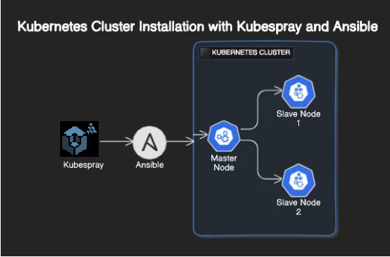
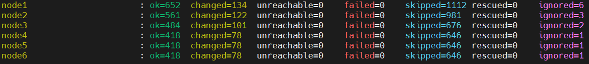

1) Первый очередь поднимем все виртуальные машины
   ```
   Master-Node-1	  192.168.95.15   CPU-2 RAM-4GB   Ubuntu-22.04
   Master-Node-2	  192.168.95.16   CPU-2 RAM-4GB   Ubuntu-22.04
   Master-Node-3	  192.168.95.17   CPU-2 RAM-4GB   Ubuntu-22.04
   Worker-Node-1	  192.168.95.18   CPU-2 RAM-4GB   Ubuntu-22.04
   Worker-Node-2	  192.168.95.19   CPU-2 RAM-4GB   Ubuntu-22.04
   Worker-Node-3	  192.168.95.20   CPU-2 RAM-4GB   Ubuntu-22.04
   ```

2) Для создания кластера Kubespray создадим еще одну виртуальную машину чтобы управлять через Ansible
   ```
   Ansible-Node     192.168.95.21   CPU-2 RAM-4GB   Ubuntu-22.04
   ```
3) Создадим на всех виртуальных машинах нового юзера
   ```
   adduser fara
   ```
4) Добавим созданного юзера в sudo группу а так же в безпарольную группу  
    ```
   nano /etc/sudoers

   fara ALL=(ALL) NOPASSWD:ALL
   ```
5) Сгенирируем ssh ключ у Ansible-Node у юзера fara
   ```
   adduser fara
   sudo su - fara
   ssh-keygen -t rsa
   ```
6) Копируем созданный ключ хостам c Ansible-Node от юзера fara
   ```
   ssh-copy-id -i ~/.ssh/id_rsa.pub fara@192.168.95.15
   ssh-copy-id -i ~/.ssh/id_rsa.pub fara@192.168.95.16
   ssh-copy-id -i ~/.ssh/id_rsa.pub fara@192.168.95.17
   ssh-copy-id -i ~/.ssh/id_rsa.pub fara@192.168.95.18
   ssh-copy-id -i ~/.ssh/id_rsa.pub fara@192.168.95.19
   ssh-copy-id -i ~/.ssh/id_rsa.pub fara@192.168.95.20
   ```
7) Далее установим pip
    ```
   sudo apt install python3-pip
   sudo pip3 install --upgrade pip
   pip --version
   ```
8) Клонируем Kubespray репозиторию
   ```
   git clone https://github.com/kubernetes-sigs/kubespray.git
   cd kubespray
   git checkout tags/v2.26.0
   sudo pip install -r requirements.txt
   ```
9) Копируем пирмер
   ```
   cp -rfp inventory/sample inventory/mycluster
   declare -a IPS=(192.168.95.15 192.168.95.16 192.168.95.17 192.168.95.18 192.168.95.19 192.168.95.20)
   CONFIG_FILE=inventory/mycluster/hosts.yaml python3 contrib/inventory_builder/inventory.py ${IPS[@]}
   ```
10) Запускаем плейбук
    ```
    ansible-playbook -i inventory/mycluster/hosts.yaml --become --become-user=root cluster.yml
    ```
11) Видим резултать
    

