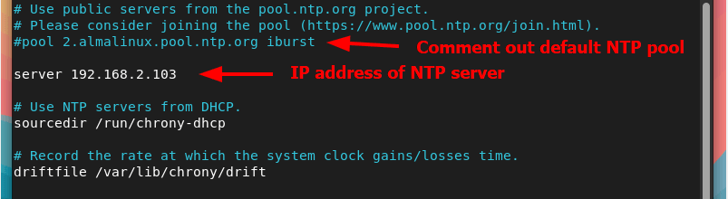

## Chrony NTP Server





### Установка в Ubuntu
1) Сначала обновим список пакетов  ```apt-get update```
2) Установим сам Chrony ```apt-get install chrony -y```
3) Установим Timezone ```timedatectl set-timezone Asia/Tashkent```
4) Перезапустим сервис и посмотрим статус  ```systemctl restart chronyd.service && systemctl status chronyd.service```
   

### Официальная документация
https://chrony-project.org/
