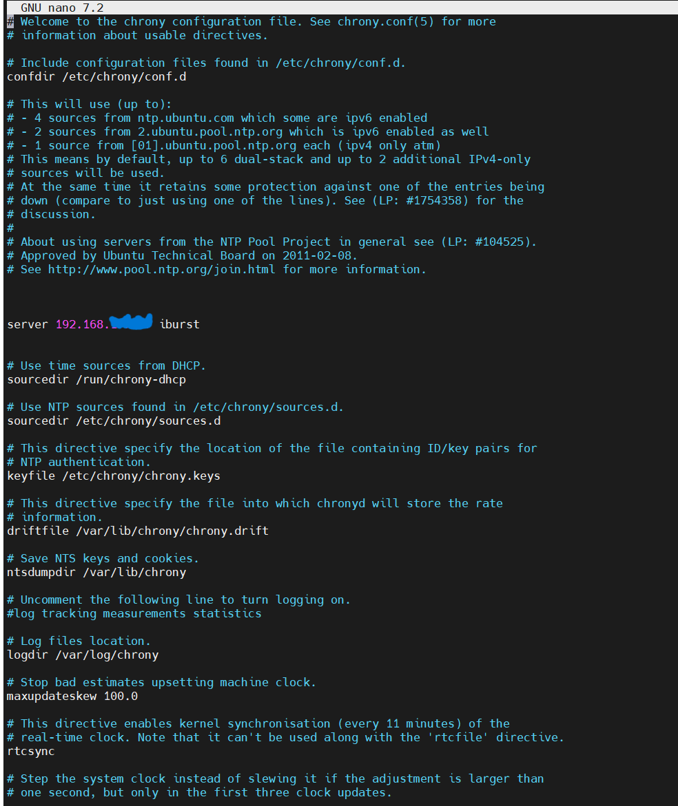

## Chrony NTP Server


### Установка в Ubuntu
1) Сначала обновим список пакетов  ```apt-get update```
2) Установим сам Chrony ```apt-get install chrony -y```
3) Установим Timezone ```timedatectl set-timezone Asia/Tashkent```
4) Перезапустим сервис и посмотрим статус  ```systemctl restart chronyd.service && systemctl status chronyd.service```

### Пример конфиг файла сервера


### Пример конфиг файла клиента


### Официальная документация
https://chrony-project.org/
