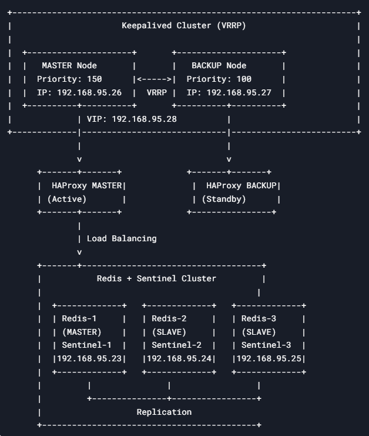

Tested on: Ubuntu 22.04 server

Необходимые вир машины
Redis-Server/Sentinal:
```
REDIS-1 - 192.168.95.23, REDIS-2 - 192.168.95.24, REDIS-3 - 192.168.95.25
```
Haproxy: 
```
HAPROXY-1 - 192.168.95.26, HAPROXY-2 - 192.168.95.27
```
KEEPALIVED_VIP_IP:
```
192.168.95.28
```
Client: 
```
CLIENT - 192.168.95.30
```
Redis Insight GUI:
```
Insight - 192.168.95.31
```

### REDIS CLUSTER 

1) Установка и начальная настройка Redis. Команды выполняются на всех машинах REDIS-1, REDIS-2, REDIS-3:
   ```
   apt-get update
   apt install net-tools -y
   apt install redis-server -y
   systemctl status redis.service
   systemctl enable redis.service
   ```

2)  Открытие порта Redis в UFW. Команды выполняются на всех машинах REDIS-1, REDIS-2, REDIS-3:
    ```
    ufw allow 6379
    ```

3) Создание переменных окружения. Команды выполняются на всех машинах REDIS-1, REDIS-2, REDIS-3:
   ```
   export REDIS_MASTER_PRIVATE_IP=192.168.95.23
   export REDIS_PORT=6379
   export REDIS_PASS=redis-master
   ```

4) Настройка мастера Redis. Команды выполнять на мастер ноде REDIS-1:
   ```
   cp /etc/redis/redis.conf /etc/redis/redis.conf.backup && \
   sed -i -E "s/(bind 127.0.0.1 ::1)//g" /etc/redis/redis.conf && \
   echo "requirepass $REDIS_PASS" | sudo tee -a /etc/redis/redis.conf && \
   echo "masterauth $REDIS_PASS" | sudo tee -a /etc/redis/redis.conf && \
   service redis-server restart
   ```

5) Настройка реплики Redis. Команды выполнять на воркер нодах REDIS-2, REDIS-3:
   ```
   sed -i -E "s/(bind 127.0.0.1 ::1)//g" /etc/redis/redis.conf && \
   echo "requirepass $REDIS_PASS" | sudo tee -a /etc/redis/redis.conf && \
   echo "masterauth $REDIS_PASS" | sudo tee -a /etc/redis/redis.conf && \
   echo "replicaof $REDIS_MASTER_PRIVATE_IP $REDIS_PORT" | sudo tee -a /etc/redis/redis.conf && \
   service redis-server restart
   ```

6) Проверка кластера
    ```
    redis-cli -a redis-master -h 192.168.95.23 -p 6379 info replication
    redis-cli -a redis-master -p 6379 info replication
    redis-cli -a redis-master -p 26379 info sentinel
    ```

7) Проверка на запись на мастере
    ```
    redis-cli -a redis-master -p 6379
    set test 1
    ```

 8) Переключимся на слейв и проверим   
     ```
     redis-cli -a redis-master -p 6379
     get test
     ```

### SENTINAL

1) Установка Redis Sentinel. Команды выполняются на всех машинах REDIS-1, REDIS-2, REDIS-3:
   ```
   apt install redis-sentinel -y
   systemctl status sentinel.service
   ```

2) Открытие порта Redis в UFW. Команды выполняются на всех машинах REDIS-1, REDIS-2, REDIS-3:
   ```
   ufw allow 6379 && ufw allow 26379
   ```
   
3) Создание переменных окружения. Команды выполняются на всех машинах REDIS-1, REDIS-2, REDIS-3:
   ```
   cp /etc/redis/sentinel.conf /etc/redis/sentinel.conf.backup && \
   export REDIS_MASTER_PRIVATE_IP=192.168.95.23 && \
   export REDIS_PORT=6379 && \
   export REDIS_SENTINEL_NAME=mymaster && \
   export REDIS_PASS=redis-master && \
   export REDIS_SENTINEL_QUORUM=2
   ```

4) Очистка и модификация дефолтных строк в конфиге. Команды выполняются на всех машинах REDIS-1, REDIS-2, REDIS-3:
   ```
   sed -i -E "s/(bind 127.0.0.1 ::1)//g" /etc/redis/sentinel.conf && \
   sed -i -E "s/(sentinel config-epoch mymaster 0)//g" /etc/redis/sentinel.conf && \
   sed -i -E "s/(sentinel leader-epoch mymaster 0)//g" /etc/redis/sentinel.conf && \
   sed -i -E "s/(sentinel monitor mymaster 127.0.0.1 6379 2)//g" /etc/redis/sentinel.conf
   ```

5) Добавление новой конфигурации. Команды выполняются на всех машинах REDIS-1, REDIS-2, REDIS-3:
   ``` 
   echo "protected-mode yes" | sudo tee -a /etc/redis/sentinel.conf && \
   echo "requirepass $REDIS_PASS" | sudo tee -a /etc/redis/sentinel.conf && \
   echo "sentinel monitor $REDIS_SENTINEL_NAME $REDIS_MASTER_PRIVATE_IP $REDIS_PORT $REDIS_SENTINEL_QUORUM" | sudo tee -a /etc/redis/sentinel.conf && \
   echo "sentinel auth-pass $REDIS_SENTINEL_NAME $REDIS_PASS" | sudo tee -a /etc/redis/sentinel.conf && \
   echo "sentinel down-after-milliseconds $REDIS_SENTINEL_NAME 3000" | sudo tee -a /etc/redis/sentinel.conf && \
   echo "sentinel failover-timeout $REDIS_SENTINEL_NAME 6000" | sudo tee -a /etc/redis/sentinel.conf && \
   echo "sentinel parallel-syncs $REDIS_SENTINEL_NAME 1" | sudo tee -a /etc/redis/sentinel.conf && \
   echo "sentinel config-epoch $REDIS_SENTINEL_NAME 0" | sudo tee -a /etc/redis/sentinel.conf && \
   echo "sentinel leader-epoch $REDIS_SENTINEL_NAME 0" | sudo tee -a /etc/redis/sentinel.conf
   ```

6) Перезапустим службу sentinal Команды выполняются на всех машинах REDIS-1, REDIS-2, REDIS-3:
   ``` 
   systemctl restart sentinel.service
   systemctl status sentinel.service
   systemctl enable sentinel.service
   redis-cli -a redis-master -p 26379 info sentinel
   ```

### HAPROXY

1) Установка HAProxy и настройка фаервола. Команды выполняются на всех машинах HAPROXY-1, HAPROXY-2:
   ```
   apt-get update
   apt install net-tools -y
   apt install haproxy -y
   ufw allow 6379
   ```

2) Создание бэкапа конфига HAProxy. Команды выполняются на всех машинах HAPROXY-1, HAPROXY-2 :
   ```
   cp /etc/haproxy/haproxy.cfg /etc/haproxy/haproxy.cfg.backup
   ```

3) Экспорт переменных окружения:
   ```
   export REDIS_IP1="192.168.95.23"
   export REDIS_IP2="192.168.95.24"
   export REDIS_IP3="192.168.95.25"
   export REDIS_PORT="6379"
   export REDIS_PASS="redis-master"
   ```

4) Генерация и применение конфига HAProxy. Команды выполняются на машинах Haproxy1 и Haproxy2:
   ```
   echo "frontend ft_redis
        bind *:6379 name redis
        mode tcp
        default_backend bk_redis

   backend bk_redis
        mode tcp
        option tcp-check
        tcp-check connect

        tcp-check send AUTH\ $REDIS_PASS\\r\\n
        tcp-check expect string +OK
        tcp-check send PING\\r\\n
        tcp-check expect string +PONG
        tcp-check send info\ replication\\r\\n

        tcp-check expect string role:master
        tcp-check send QUIT\\r\\n
        tcp-check expect string +OK
        server Redis1 $REDIS_IP1:$REDIS_PORT check inter 3s
        server Redis2 $REDIS_IP2:$REDIS_PORT check inter 3s
        server Redis3 $REDIS_IP3:$REDIS_PORT check inter 3s
   " | sudo tee -a /etc/haproxy/haproxy.cfg
   ```

5) Перезапускаем службы haproxy на машинах Haproxy1 и Haproxy2:
   ```
   systemctl restart haproxy.service
   systemctl enable haproxy.service
   systemctl status haproxy.service
   ```

6) Установка и запуск Keepalived. Команды выполняются на машинах Haproxy1 и Haproxy2:
   ```
   apt-get update
   sudo apt install keepalived -y
   systemctl enable keepalived.service
   systemctl restart keepalived.service
   systemctl status keepalived.service
   ```

7) Экспорт переменных окружения. Команды выполняются на машинах Haproxy1 и Haproxy2 :
   ```
   export HAPROXY_IP1="192.168.95.26"
   export HAPROXY_IP2="192.168.95.27"
   export VIP="192.168.95.28"
   export KEEPALIVED_PASS="redis-master"
   ```

8) Настройка Keepalived на основном сервере Haproxy1:
   ```
   echo "global_defs {
       router_id LVS_PROXY1
   }

   vrrp_script check_proxy {
       script \"/usr/bin/killall -0 haproxy\"
       interval 1
       fall 4
       rise 2
   }

   vrrp_instance VI_1 {
       state BACKUP
       nopreempt
       interface ens18
       virtual_router_id 51
       priority 150
       advert_int 1
   
       track_script {
           check_proxy
       }
       authentication {
           auth_type PASS
           auth_pass $KEEPALIVED_PASS
       }
       unicast_src_ip $HAPROXY_IP1
       unicast_peer {
           $HAPROXY_IP2
       }
       virtual_ipaddress {
          $VIP/17
       }
   }" | sudo tee /etc/keepalived/keepalived.conf
   ```

9) Настройка Keepalived на бекап сервере Haproxy2:
   ```
   echo "global_defs {
       router_id LVS_PROXY2
   }

   vrrp_script check_proxy {
       script \"/usr/bin/killall -0 haproxy\"
       interval 1
       fall 4
       rise 2
   }

   vrrp_instance VI_1 {
       state BACKUP
       nopreempt
       interface ens18
       virtual_router_id 51
       priority 149
       advert_int 1
   
       track_script {
           check_proxy
       }
       authentication {
           auth_type PASS
           auth_pass $KEEPALIVED_PASS
       }
       unicast_src_ip $HAPROXY_IP2
       unicast_peer {
           $HAPROXY_IP1
       }
       virtual_ipaddress {
           $VIP/17
       }
   }" | sudo tee /etc/keepalived/keepalived.conf 
   ```

10) Проверим статус Keepalived
    ```
    systemctl restart keepalived.service
    systemctl status keepalived.service
    ```

### Redis Insight GUI

1) Переходим на официальный сайт:  ```https://redis.io/insight/```
2) Cкачиваем установщик для Windows и подключимся к Redis Cluster


