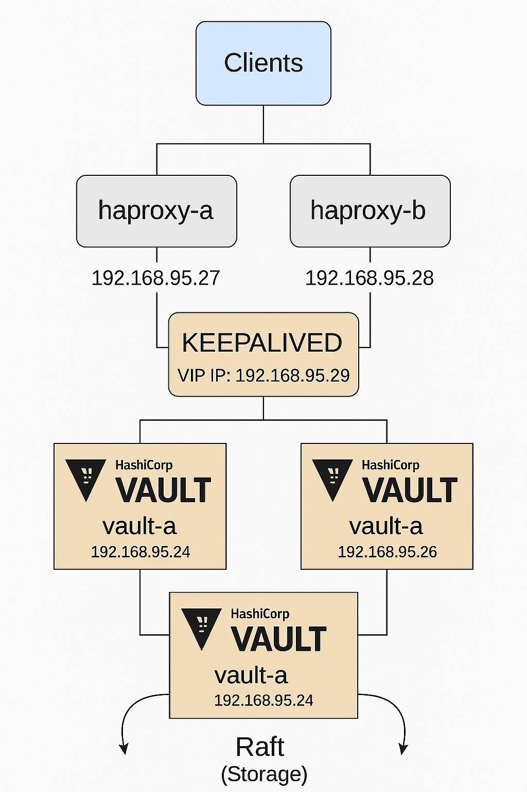

Инсталляция HashiCorp Vault в HA режиме с integrated storage



Необходимые ресурсы:
vault-a.open.lab 192.168.95.24 Ubuntu 22.04 server
vault-b.open.lab 192.168.95.25 Ubuntu 22.04 server
vault-c.open.lab 192.168.95.26 Ubuntu 22.04 server

haproxy1 192.168.95.27 Ubuntu 22.04 server
haproxy2 192.168.95.28 Ubuntu 22.04 server

VIP_IP_ADDRESS 192.168.95.29


### VAULT

1) На каждой ноде добавим следующие записи в ```nano /etc/hosts``` (vault-a.open.lab, vault-b.open.lab, vault-c.open.lab): 
   ```
   192.168.95.24 vault-a.open.lab 
   192.168.95.25 vault-b.open.lab 
   192.168.95.26 vault-c.open.lab
   192.168.95.27 haproxy-a.open.lab 
   192.168.95.28 haproxy-b.open.lab
   192.168.95.29 haproxy-vip.open.lab
   ```

2) Установим hostname на каждой ноде (vault-a.open.lab, vault-b.open.lab, vault-c.open.lab):
   ```
   hostnamectl set-hostname vault-a.open.lab
   hostnamectl set-hostname vault-b.open.lab
   hostnamectl set-hostname vault-c.open.lab
   ```
3) Установим на каждой ноде vault (vault-a.open.lab, vault-b.open.lab, vault-c.open.lab):
   ```
   apt-get update
   wget -O - https://apt.releases.hashicorp.com/gpg | sudo gpg --dearmor -o /usr/share/keyrings/hashicorp-archive-keyring.gpg
   echo "deb [arch=$(dpkg --print-architecture) signed-by=/usr/share/keyrings/hashicorp-archive-keyring.gpg] https://apt.releases.hashicorp.com $(lsb_release -cs) main" | sudo tee /etc/apt/sources.list.d/hashicorp.list
   sudo apt update && sudo apt install vault
   vault -v
   ```

4) Далее необходимо обзавестись сертификатами. Если таковые отсутствуют – выпустить свои, самоподписанные. Все операции я выполняю с первой ноды vault-a.open.lab.
   Сперва выпустим свой CA сертификат, а затем с его помощью подпишем сертификаты для всех узлов кластера:
   ```
   cd /opt/vault/tls/
   rm -rf *
   openssl genrsa 2048 > vault-ca-key.pem
   openssl req -new -x509 -nodes -days 3650 -key vault-ca-key.pem -out vault-ca-cert.pem
   ```

5) Теперь подготовим конфигурационные файлы, содержащие Subject Alternate Name (SAN) для каждого из узлов. Важно, чтобы в SAN был корректней хостнейм и IP каждого узла.
   Все операции я выполняю с первой ноды vault-a.open.lab:
   ```
   echo "[v3_ca]
   subjectAltName = @alt_names
   [alt_names]
   DNS.1 = vault-a.open.lab
   IP.1 = 192.168.95.24
   IP.2 = 127.0.0.1
   IP.3 = 192.168.95.29
   " > ./cert-a.cfg
   ```
   ```
   echo "[v3_ca]
   subjectAltName = @alt_names
   [alt_names]
   DNS.1 = vault-b.open.lab
   IP.1 = 192.168.95.25
   IP.2 = 127.0.0.1
   IP.3 = 192.168.95.29
   " > ./cert-b.cfg
   ```
   ```
   echo "[v3_ca]
   subjectAltName = @alt_names
   [alt_names]
   DNS.1 = vault-c.open.lab
   IP.1 = 192.168.95.26
   IP.2 = 127.0.0.1
   IP.3 = 192.168.95.29
   " > ./cert-c.cfg
   ```

6) Теперь для каждого из узлов сформируем CSR файл. Все операции я выполняю с первой ноды vault-a.open.lab:
   ```
   openssl req -newkey rsa:2048 -nodes -keyout vault-a-key.pem -out vault-a-csr.pem -subj "/CN=vault-a.open.lab"
   openssl req -newkey rsa:2048 -nodes -keyout vault-b-key.pem -out vault-b-csr.pem -subj "/CN=vault-b.open.lab"
   openssl req -newkey rsa:2048 -nodes -keyout vault-c-key.pem -out vault-c-csr.pem -subj "/CN=vault-c.open.lab"
   ```

7) И выпустим сертификаты на основании запросов. Все операции я выполняю с первой ноды vault-a.open.lab:
   ```
   openssl x509 -req -set_serial 01 -days 3650 -in vault-a-csr.pem -out vault-a-cert.pem -CA vault-ca-cert.pem -CAkey vault-ca-key.pem -extensions v3_ca -extfile ./cert-a.cfg
   openssl x509 -req -set_serial 01 -days 3650 -in vault-b-csr.pem -out vault-b-cert.pem -CA vault-ca-cert.pem -CAkey vault-ca-key.pem -extensions v3_ca -extfile ./cert-b.cfg
   openssl x509 -req -set_serial 01 -days 3650 -in vault-c-csr.pem -out vault-c-cert.pem -CA vault-ca-cert.pem -CAkey vault-ca-key.pem -extensions v3_ca -extfile ./cert-c.cfg
   ```

8) Скопируем сертификаты и ключи на узлы vault-b.open.lab и vault-c.open.lab:
   ```
   scp ./vault-b-key.pem ./vault-b-cert.pem ./vault-ca-cert.pem farrukh@vault-b.open.lab:/opt/vault/tls
   scp ./vault-c-key.pem ./vault-c-cert.pem ./vault-ca-cert.pem farrukh@vault-c.open.lab:/opt/vault/tls
   ```

9) На каждом из узлов установим соответствующие права для доступа к файлам сертификатов и ключам (vault-a.open.lab):
   ```
   chown root:root /opt/vault/tls/vault-a-cert.pem /opt/vault/tls/vault-ca-cert.pem
   chown root:vault /opt/vault/tls/vault-a-key.pem
   chmod 0644 /opt/vault/tls/vault-a-cert.pem /opt/vault/tls/vault-ca-cert.pem
   chmod 0640 /opt/vault/tls/vault-a-key.pem
   ```

10) На каждом из узлов установим соответствующие права для доступа к файлам сертификатов и ключам (vault-b.open.lab):
    ```
    chown root:root /opt/vault/tls/vault-b-cert.pem /opt/vault/tls/vault-ca-cert.pem
    chown root:vault /opt/vault/tls/vault-b-key.pem
    chmod 0644 /opt/vault/tls/vault-b-cert.pem /opt/vault/tls/vault-ca-cert.pem
    chmod 0640 /opt/vault/tls/vault-b-key.pem
    ```

11) На каждом из узлов установим соответствующие права для доступа к файлам сертификатов и ключам (vault-c.open.lab):
    ```
    chown root:root /opt/vault/tls/vault-c-cert.pem /opt/vault/tls/vault-ca-cert.pem
    chown root:vault /opt/vault/tls/vault-c-key.pem
    chmod 0644 /opt/vault/tls/vault-c-cert.pem /opt/vault/tls/vault-ca-cert.pem
    chmod 0640 /opt/vault/tls/vault-c-key.pem
    ```

12) Теперь, когда для каждой из нод готовы сертификаты. Перейдем к конфигурации Vault. Отредактируем конфигурационный файл vault для первой ноды vault-a.open.lab: ```nano /etc/vault.d/vault.hcl```
    ```
    mv /etc/vault.d/vault.hcl /etc/vault.d/vault.hcl_original
    ```
    ```
    cluster_addr  = "https://192.168.95.24:8201"
    api_addr      = "https://192.168.95.24:8200"
    disable_mlock = true

    ui = true

    listener "tcp" {
      address            = "0.0.0.0:8200"
      tls_ca_cert_file   = "/opt/vault/tls/vault-ca-cert.pem"
      tls_cert_file      = "/opt/vault/tls/vault-a-cert.pem"
      tls_key_file       = "/opt/vault/tls/vault-a-key.pem"

    }

    storage "raft" {
      path    = "/opt/vault/data"
      node_id = "vault-a.open.lab"

      retry_join {
        leader_tls_servername   = "vault-a.open.lab"
        leader_api_addr         = "https://192.168.95.24:8200"
        leader_ca_cert_file     = "/opt/vault/tls/vault-ca-cert.pem"
        leader_client_cert_file = "/opt/vault/tls/vault-a-cert.pem"
        leader_client_key_file  = "/opt/vault/tls/vault-a-key.pem"
      }
      retry_join {
        leader_tls_servername   = "vault-b.open.lab"
        leader_api_addr         = "https://192.168.95.25:8200"
        leader_ca_cert_file     = "/opt/vault/tls/vault-ca-cert.pem"
        leader_client_cert_file = "/opt/vault/tls/vault-a-cert.pem"
        leader_client_key_file  = "/opt/vault/tls/vault-a-key.pem"
      }
      retry_join {
        leader_tls_servername   = "vault-c.open.lab"
        leader_api_addr         = "https://192.168.95.26:8200"
        leader_ca_cert_file     = "/opt/vault/tls/vault-ca-cert.pem"
        leader_client_cert_file = "/opt/vault/tls/vault-a-cert.pem"
        leader_client_key_file  = "/opt/vault/tls/vault-a-key.pem"
      }
    }
    ```

14) Отредактируем конфигурационный файл vault для первой ноды vault-b.open.lab: ```nano /etc/vault.d/vault.hcl```
    ```
    mv /etc/vault.d/vault.hcl /etc/vault.d/vault.hcl_original
    ```
    ```
    cluster_addr  = "https://192.168.95.25:8201"
    api_addr      = "https://192.168.95.25:8200"
    disable_mlock = true

    ui = true

    listener "tcp" {
      address            = "0.0.0.0:8200"
      tls_ca_cert_file   = "/opt/vault/tls/vault-ca-cert.pem"
      tls_cert_file      = "/opt/vault/tls/vault-b-cert.pem"
      tls_key_file       = "/opt/vault/tls/vault-b-key.pem"

    }

    storage "raft" {
      path    = "/opt/vault/data"
      node_id = "vault-b.open.lab"

      retry_join {
        leader_tls_servername   = "vault-a.open.lab"
        leader_api_addr         = "https://192.168.95.24:8200"
        leader_ca_cert_file     = "/opt/vault/tls/vault-ca-cert.pem"
        leader_client_cert_file = "/opt/vault/tls/vault-b-cert.pem"
        leader_client_key_file  = "/opt/vault/tls/vault-b-key.pem"
      }
      retry_join {
        leader_tls_servername   = "vault-b.open.lab"
        leader_api_addr         = "https://192.168.95.25:8200"
        leader_ca_cert_file     = "/opt/vault/tls/vault-ca-cert.pem"
        leader_client_cert_file = "/opt/vault/tls/vault-b-cert.pem"
        leader_client_key_file  = "/opt/vault/tls/vault-b-key.pem"
      }
      retry_join {
        leader_tls_servername   = "vault-c.open.lab"
        leader_api_addr         = "https://192.168.95.26:8200"
        leader_ca_cert_file     = "/opt/vault/tls/vault-ca-cert.pem"
        leader_client_cert_file = "/opt/vault/tls/vault-b-cert.pem"
        leader_client_key_file  = "/opt/vault/tls/vault-b-key.pem"
      }
    }  

    ```
    
15) Отредактируем конфигурационный файл vault для первой ноды vault-c.open.lab: ```nano /etc/vault.d/vault.hcl```
    ```
    mv /etc/vault.d/vault.hcl /etc/vault.d/vault.hcl_original
    ```
    ```
    cluster_addr  = "https://192.168.95.26:8201"
    api_addr      = "https://192.168.95.26:8200"
    disable_mlock = true

    ui = true

    listener "tcp" {
      address            = "0.0.0.0:8200"
      tls_ca_cert_file   = "/opt/vault/tls/vault-ca-cert.pem"
      tls_cert_file      = "/opt/vault/tls/vault-c-cert.pem"
      tls_key_file       = "/opt/vault/tls/vault-c-key.pem"

    }

    storage "raft" {
      path    = "/opt/vault/data"
      node_id = "vault-c.open.lab"

      retry_join {
        leader_tls_servername   = "vault-a.open.lab"
        leader_api_addr         = "https://192.168.95.24:8200"
        leader_ca_cert_file     = "/opt/vault/tls/vault-ca-cert.pem"
        leader_client_cert_file = "/opt/vault/tls/vault-c-cert.pem"
        leader_client_key_file  = "/opt/vault/tls/vault-c-key.pem"
      }
      retry_join {
        leader_tls_servername   = "vault-b.open.lab"
        leader_api_addr         = "https://192.168.95.25:8200"
        leader_ca_cert_file     = "/opt/vault/tls/vault-ca-cert.pem"
        leader_client_cert_file = "/opt/vault/tls/vault-c-cert.pem"
        leader_client_key_file  = "/opt/vault/tls/vault-c-key.pem"
      }
      retry_join {
        leader_tls_servername   = "vault-c.open.lab"
        leader_api_addr         = "https://192.168.95.26:8200"
        leader_ca_cert_file     = "/opt/vault/tls/vault-ca-cert.pem"
        leader_client_cert_file = "/opt/vault/tls/vault-c-cert.pem"
        leader_client_key_file  = "/opt/vault/tls/vault-c-key.pem"
      }
    }

    ```

16) Интересные параметры:
    api_addr – адрес и порт, на котором будет доступен API сервер;
    cluster_addr – адрес и порт по которому будут взаимодействовать кластерные сервисы;
    disable_mlock – рекомендуемый параметр при использовании Integrated Storage;
    ui – включение доступа к веб-интерфейсу Vault;
    в секции listener указываются сертификаты, которые будут использованы при сетевом взаимодействии. У каждой ноды они свои, за исключением CA, данный сертификат одинаковый для всех.

    Секцию storage стоит так же рассмотреть:
    path = “/opt/vault/data” – директория, где будут храниться данные Vault;
    node_id = “vault-a.open.lab” – id, с которым нода будет участвовать в кластере. У каждой ноды он должен отличаться;
    Далее идут несколько секций retry_join, с перечислением всех узлов кластера. Поскольку доподлинно неизвестно, какой из узлов будет активным при запуске служб Vault, будет произведена попытка подключения к каждому из узлов.
    Здесь же указываются адреса узлов – leader_api_addr, leader_tls_servername – хостнейм сервера, который должен совпадать с тем, что прописано в сертификате данного сервера. Так же указываются сертификаты, которыми клиент будет 
    подключаться к лидеру (у каждой из нод свои сертификаты, которые мы создавали ранее).
    Обратите внимание как меняются поля с адресами, сертификатами, а также node_id. Это важно.

18) Теперь, когда конфигурационные файлы готовы, возвращаемся на первый узел vault-a.open.lab. Добавляем Vault в автозагрузку и автоматически его запускаем:
    ```
    systemctl enable --now vault.service
    systemctl status vault.service
    ```

19) Проверим статус Vault, предварительно отменив проверку сертификатов, выставив значение специальной переменной на первой ноде vault-a.open.lab:
    ```
    export VAULT_SKIP_VERIFY="true"
    vault status
    ```

    Как можно заметить на текущий момент Vault не инициализирован (Initialized false), а также запечатан (Sealed true).
    Примечание: добавив наш CA файл, сгенерированный ранее, в список доверенных сертификатов, прибегать к отмене проверки сертификатов будет необязательно.

20) Инициализируем Vault на первой ноде vault-a.open.lab:
    ```
    vault operator init
    ```
    Vault выдаст 5 ключей, которые необходимо использовать при «распечатке». Как сказано выше, после каждой остановки либо перезапуска, Vault будет вновь находиться в запечатанном состоянии и для открытия нужно будет использовать любые три 
    из пяти предоставленных ключей. Терять эти ключи не стоит!
    Так же нам предоставляется Root Token для доступа к Vault с максимальными правами.

21) Распечатаем Vault на первой ноде vault-a.open.lab:
    ```
    vault operator unseal
    ```
    ```
    vault operator unseal
    ```
    ```
    vault operator unseal
    ```
    *Примечание: каждый раз когда введём ```vault operator unseal``` от нас будет просит пароль. Мы должны ввести 3 разных пароля который получили во время команды  ```vault operator init```
    На данном этапе мы настроили одну ноду Vault, а также инициализировали и распечатали ее. Теперь подключим в кластер две других ноды.
    Ранее мы уже подготовили и разместили конфигурационные файлы на нодах vault-b.open.lab и vault-c.open.lab.

22) Подключаемся к ноде vault-b.open.lab, запускаем Vault:
    ```
    systemctl enable --now vault
    systemctl status vault
    ```
    Теперь, в отличии от первой ноды vault-a.open.lab, инициализировать Vault больше не нужно, но новая нода все еще в запечатанном состоянии.

23) Распечатаем ноду vault-b.open.lab:
    ```
    export VAULT_SKIP_VERIFY="true"
    ```
    ```
    vault operator unseal
    ```
    ```
    vault operator unseal
    ```
    ```
    vault operator unseal
    ```
    *Примечание: каждый раз когда введём ```vault operator unseal``` от нас будет просит пароль. Мы должны ввести 3 разных пароля который получили во время команды  ```vault operator init```
    После распечатки нода будет подключена к кластеру. Можно обратить внимание, что новая нода находится в режиме standby, так же можно определить текущий адрес активной ноды. Это нода vault-a.open.lab.

24) Подключимся к ноде vault-c.open.lab и выполним аналогичные действия:
    ```
    systemctl enable --now vault
    systemctl status vault
    export VAULT_SKIP_VERIFY="true"
    ```
    ```
    vault operator unseal
    ```
    ```
    vault operator unseal
    ```
    ```
    vault operator unseal
    ```
    Теперь мы успешно сформировали кластер из трех нод. Вернемся на первую vault-a.open.lab и проверим состояние кластера.

25) Перейдём на ноду vault-a.open.lab и авторизуемся с токеном, который был получен ранее:
    ```
    vault login
    ```
    ```
    vault operator raft list-peers
    ```
    По статусу видно 3 сервера, один из которых в статусе лидера, а два других – ведомые.

26) Попробуем добавить новый секрет в хранилище. Для этого используем механизм kv (key-value) на первой ноде vault-a.open.lab:
    ```
    vault secrets enable -path=vmik-secrets/ kv
    ```

27) И поместим секрет под именем db на первой ноде vault-a.open.lab:
    ```
    vault kv put vmik-secrets/db password=vmik
    ```

28) Посмотрим список всех секретов в нашем KV хранилище vmik-secrets на первой ноде vault-a.open.lab:
    ```
    vault kv list vmik-secrets
    ```
    ```
    vault kv get vmik-secrets/db
    ```

29) Проверим работоспособность механизма HA. Отключим первую ноду vault-a.open.lab:
    ```
    shutdown -h now
    ```

30) Подключимся к второй ноде vault-a.open.lab и проверим статус:
    ```
    vault status
    ```
    HA Mode изменено со standby на active. Запросим список узлов raft:
    ```
    vault operator raft list-peers
    ```
    Лидер так же был перенесен на ноду vault-b.open.lab. В завершении запросим ранее созданный секрет:
    ```
    vault kv get vmik-secrets/db
    ```

31) Vault продолжает функционировать при потере одной активной ноды. Отключим ноду vault-b.open.lab. Теперь из трех узлов доступен только один. Проверим работоспособность:
    ```
    shutdown -h now
    ```

32) Статус Vault с ноды vault-c.open.lab:
    ```
    vault status
    ```
    Активная нода не изменилась. Нода vault-c.open.lab все так же в режиме standby. Аналогично, не удастся запросить и секрет, поскольку запрос перенаправляется на ранее активную ноду vault-b.open.lab:

    ```
    vault kv get vmik-secrets/db
    ```

33) Запустим обратно ноду vault-a.open.lab. После запуска, как и ожидается, нода vault-b.open.lab находится в статусе sealed:
    ```
    vault status
    ```
    Распечатаем:
    ```
    vault operator unseal
    ```
    ```
    vault operator unseal
    ```
    ```
    vault operator unseal
    ```
    Проверим статус:
    ```
    vault status
    ```
    Работа кластера восстановлена. Нода vault-c.open.lab теперь активная. Доступ к секретам так же восстановлен:
    ```
    vault kv get vmik-secrets/db
    ```
    Запустим обратно выключенную ноду B и распечатаем. На этом работа по настройке кластера Vault закончена.
    Нерассмотренным остался один вопрос – как подключаться внешним клиентам? Подключение к любой из standby нод перенаправит запрос на active ноду, поэтому знать текущий адрес активной ноды не обязательно.
    Однако, клиент может не знать все адреса Vault и в случае отключения известной ноды, доступ клиента к Vault может прекратиться.
    


### HAProxy

1) Создайте объединённый сертификат для HAProxy, если хотите использовать его для SSL-терминации (например, vault.pem). Это может быть комбинация вашего публичного сертификата и ключа.
   Команду выполним на ноде vault-a.open.lab:
   ```
   cd /opt/vault/tls
   ```
   ```
   cat vault-a-cert.pem vault-a-key.pem > /etc/haproxy/certs/vault.pem
   ```
   ```
   scp /home/farrukh/vault.pem farrukh@192.168.95.27:/home/farruk
   scp vault-ca-cert.pem farrukh@192.168.95.27:/home/farrukh
   ```
   

1) Установим на всех нодах
   ```
   apt-get update
   apt-get install -y haproxy
   ```

2) Отредактируем файл haproxy.cfg
   ```
   frontend vault_frontend
     bind *:8200 ssl crt /etc/haproxy/certs/vault.pem alpn h2,http/1.1
     default_backend vault_backend

   backend vault_backend
     option httpchk GET /v1/sys/health
     http-check expect status 200
     server vault1 vault-a.open.lab:8200 ssl verify required ca-file /etc/ssl/certs/vault-ca-cert.pem check
     server vault2 vault-b.open.lab:8200 ssl verify required ca-file /etc/ssl/certs/vault-ca-cert.pem check
     server vault3 vault-c.open.lab:8200 ssl verify required ca-file /etc/ssl/certs/vault-ca-cert.pem check

   ```

3) Перезапустим службу
   ```
   systemctl restart haproxy.service
   systemctl status haproxy.service
   ```

### Keepalived

1) Установим keepalived
   ```
   apt-get install -y keepalived
   ```

2) Конфиг файл Мастера: keepalived.conf
   ```
   vrrp_instance VI_1 {
    state MASTER
    interface ens18
    virtual_router_id 51
    priority 150
    advert_int 1
    authentication {
        auth_type PASS
        auth_pass mysecurepass
    }
    virtual_ipaddress {
        192.168.95.29
    }
   }
   ```

3) Конфиг файл Слейва: keepalived.conf
   ```
   vrrp_instance VI_1 {
    state BACKUP
    interface ens18
    virtual_router_id 51
    priority 100
    advert_int 1
    authentication {
        auth_type PASS
        auth_pass mysecurepass
    }
    virtual_ipaddress {
        192.168.95.29
    }
   }
   ```
   

Источник:  https://vmik.net/2022/02/01/hc-vault-install-raft/


    


   
